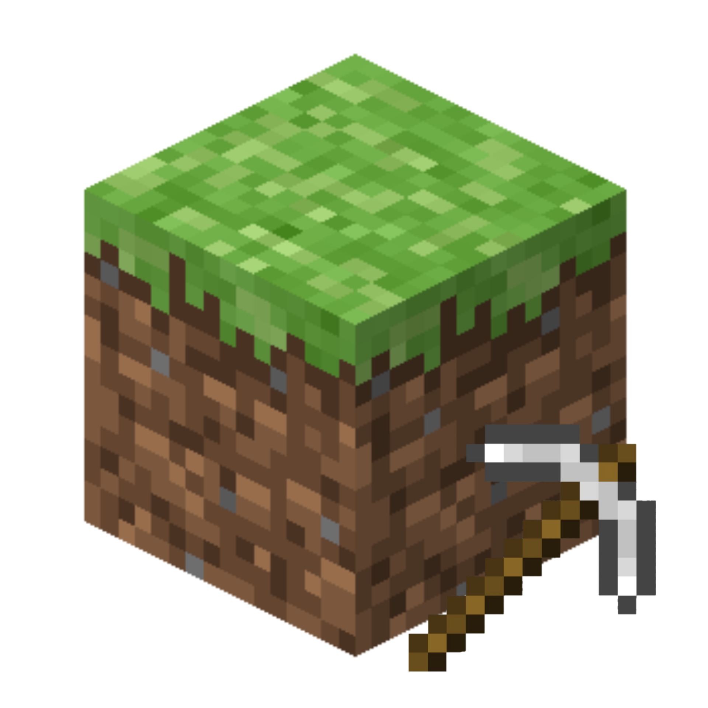

# Classic Editor

A save editor for Minecraft Classic and older Minecraft Java versions.

## About

Classic Editor is a tool for viewing and editing Minecraft Classic save files.

The project was created to make working with old Minecraft worlds easier, without having to manually inspect or modify the save files.

It provides a simple interface for exploring world data, player information, inventory, entities, and other data stored in the save.

The interface is inspired by tools such as NBTExplorer, while being designed specifically around the save formats used by older Minecraft versions.

## Features

- Open Minecraft Classic save files
- View world information
- Edit player data
- Edit inventory data
- View and edit entity data
- Explore save structures
- Save modified data back to the world
- Simple tree-based interface
- Support for Minecraft Classic save formats
- Designed for older Minecraft Java versions

## Requirements

- Java 8 or newer
- A compatible Minecraft Classic save
- The Minecraft version JAR compatible with the save
- `level.dat`

Java downloads:

- https://adoptium.net/
- https://www.oracle.com/java/technologies/downloads/

## Installation

### Linux / Termux

Clone the repository:

    git clone https://github.com/YOUR_USERNAME/ClassicEditor.git
    cd ClassicEditor

Compile the source:

    mkdir -p build
    javac -d build src/*.java

Place `level.dat` and the compatible Minecraft JAR in the project directory.

Example structure:

    ClassicEditor/
    ├── build/
    ├── src/
    ├── logo.png
    ├── level.dat
    ├── c0.30-1.jar
    └── README.md

Run Classic Editor:

    java -cp "build:c0.30-1.jar" ClassicEditor level.dat c0.30-1.jar

### Windows

Clone the repository:

    git clone https://github.com/YOUR_USERNAME/ClassicEditor.git
    cd ClassicEditor

Compile:

    mkdir build
    javac -d build src/*.java

Run:

    java -cp "build;c0.30-1.jar" ClassicEditor level.dat c0.30-1.jar

The first argument is the save file and the second argument is the Minecraft JAR.

## Minecraft Versions

Classic Editor is mainly focused on Minecraft Classic and older Minecraft Java versions.

Different versions may use different save structures and classes, so compatibility can vary between versions.

Using the Minecraft JAR that matches the save is recommended.

## Backups

Always create a backup before editing a world.

    cp level.dat level.dat.backup

This makes it possible to restore the original save if something goes wrong.

## Development

Classic Editor is written in Java.

The source code is located in the `src` directory and compiled classes are placed in the `build` directory.

The project is still under development, so features and compatibility may change over time.

## Current Status

Classic Editor is currently in development.

Some features may only work with specific Minecraft versions, and some save data may not yet be fully supported.

## Contributing

Bug reports, fixes, and improvements are welcome.

When reporting a problem, include the Minecraft version, Java version, what you were doing, and any error message that appeared.

## Disclaimer

Classic Editor is an independent project and is not affiliated with or endorsed by Mojang or Microsoft.

Always keep a backup of your Minecraft worlds before editing them.

## License

See the repository license for information about using, modifying, and distributing this project.
